# Elias — Merchants on the Road

## Full Scene Map

The small diagrams below are the only place each section's internal structure is defined — one source of truth. This map shows the high-level shape of the whole scene by treating each *section* as a single node, linked the way the sections actually connect. No node or edge is duplicated from the diagrams below; scroll to a section's own diagram for its internal detail.

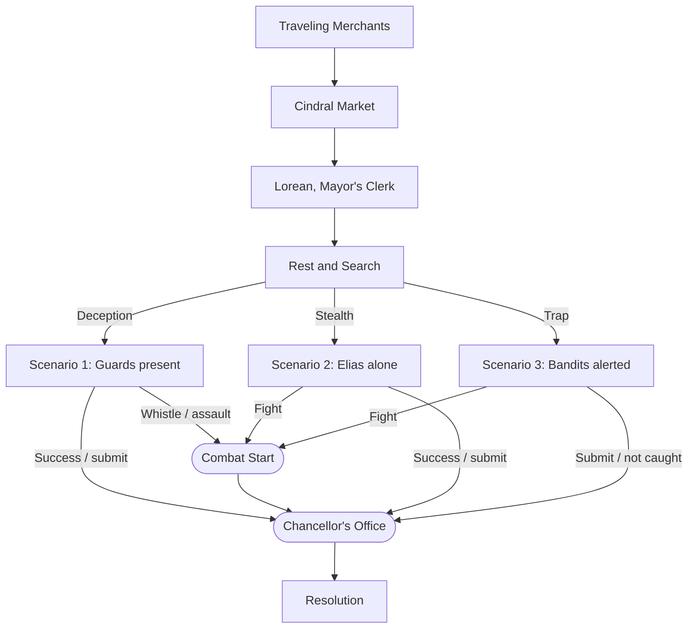

---

## Encounter: Traveling Merchants

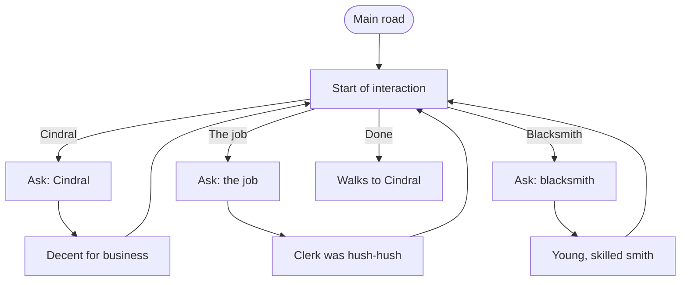

**Start.** Elias is traveling along a main road taking inventory of his supplies. On a recent job his sword was damaged, and he's seeking to repair or replace it, but he isn't near any major cities.

**M0.** Elias may ask the merchants about Cindral, the job, or the blacksmith, in any order, before continuing on. Each answer loops back to this state.

**M1_Q — Ask About Cindral.** Elias: "What could you tell me about Cindral?"
**M1_A.** Merchant: "It's a decent enough place to do business, from what we could tell. There's not much in the way of competition."

**M2_Q — Ask About the Job.** Elias: "What could you tell me about this job?"
**M2_A.** Merchant: "Not much in the way of details. The scrawny punk who asked us was all hush about the whole thing."

**M3_Q — Ask About the Blacksmith.** Elias: "Does Cindral have a decent blacksmith?"
**M3_A.** Merchant: "Yes, we met him while we were in town. Younger man, but skilled enough to get the job done."

**M4.** He continues walking along the road until he reaches the village.

---

## Encounter: Cindral Market

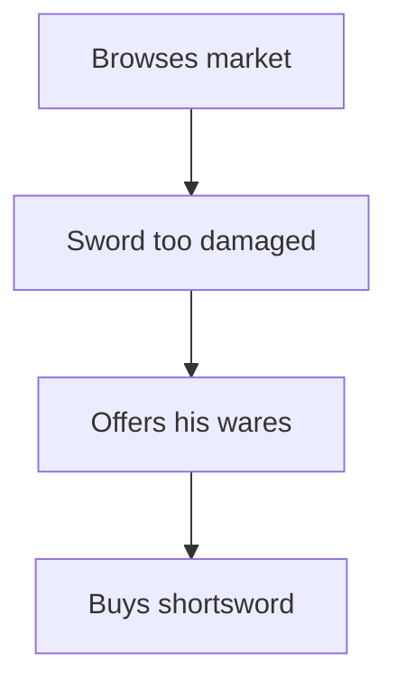

**MK1.** Upon arrival, Elias observes a busy local market, with a commodity/bartering based trading system. He walks past a blacksmith's stall, and stops to inspect the wares.

**MK2.** The smith tells him that it's a shame that the sword was damaged so heavily, as it is of very high quality and was very intricately crafted.

**MK3.** He doesn't have the tools or materials on hand to do such specialized work. He does, however, encourage Elias to browse his wares and select a new sword.

**MK4.** He picks out a shortsword, but keeps his old damaged one in hopes of eventually getting it fixed.

---

## Encounter: Lorean, the Mayor's Clerk

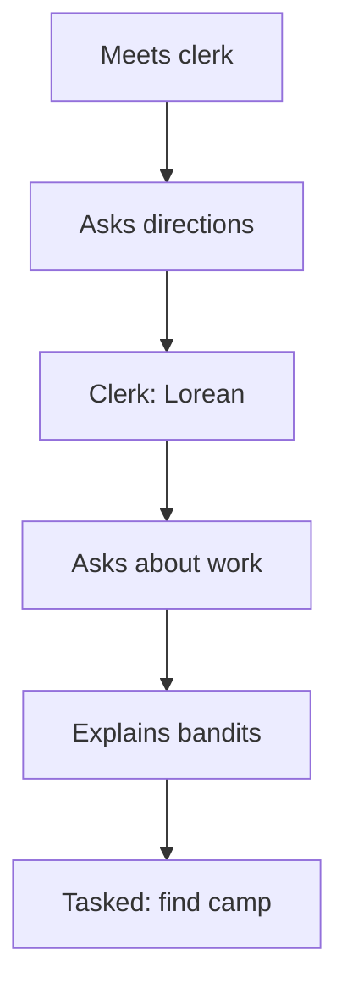

**L1.** As Elias searches for the mayor's office, a strange man stands in the road. He has a checklist, a stack of books, and several important looking papers balanced precariously in his arms. He looks a bit tired/overworked.

**L2.** Elias thinks this person might be able to point him in the right direction, and asks if he knows where the mayor's office is located.

**L3.** **Lorean:** "I might be who you're looking for, as I am the mayor's clerk, Lorean." He asks Elias what he can help with.

**L4.** Elias inquires about the need for mercenary work.

**L5.** Lorean tells him about the recent issue with bandits robbing the villagers, as well as the merchants who pass through along the nearby road.

**L6.** Elias is tasked with aiding the village guards in tracking down the bandit's camp, and eliminating the threat.

---

## Rest and Search

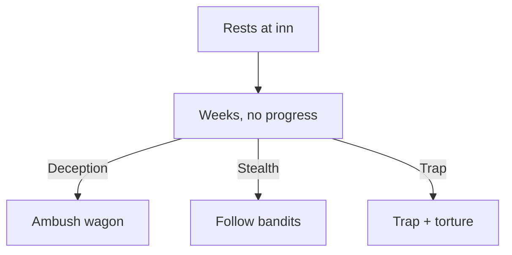

**Inn.** He is pointed to the local inn, where he is able to have a meal and rest for the night.

**Weeks.** Over the next few weeks, he works with the guards in locating the bandit camp. After a few weeks with little to no progress, he…
- **Deception / active:** Disguised as a small group of merchants, Elias and the guards camp in the woods by the main road, with a wagon of goods from the village left relatively unattended. As expected, the bandits strike in the middle of the night, and Elias must fight off the attack.
- **Stealth / passive:** Focus on the village, find out how the bandits are getting in, watch them leave and follow them back to their camp.
- **Trap / Aggressive:** Find out how they're getting into the village, set a bear trap, and torture information out of the caught bandit.

---

## Scenario 1: Camp Found, Guards Present

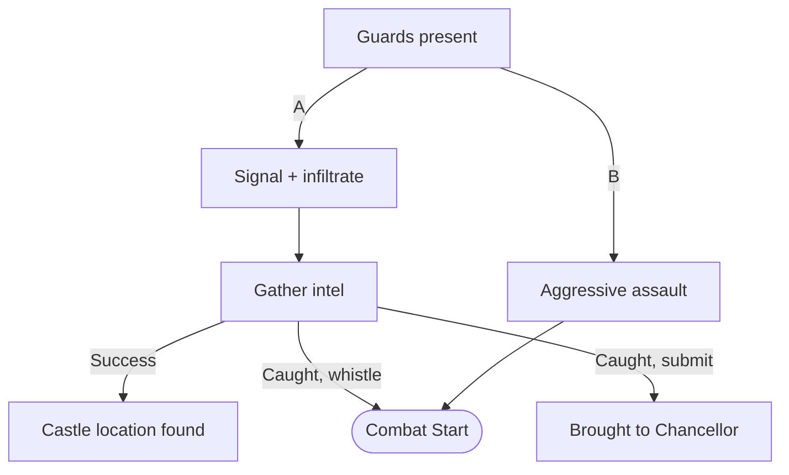

**Scen1.** You were able to find the bandit camp. You have the group of soldiers with you. An attack will be easier, but an infiltration will be harder with more people.
- **Option A:** Have the guards wait outside the camp, with a pre-established signal to move in if needed. Elias will attempt to infiltrate the camp and seek out the bandit leader.
- **Option B:** Fight aggressively — find the leader by force.

**S1A_Obj.** Mission objective: obtain information on the bandits and their leader (stealth).
- **Success:** Location of the Chancellor's castle found.
- **Caught, whistle:** Whistle to call soldiers — combat begins.
- **Caught, submit:** Submit to be brought to the bandit's leader, then to the Chancellor.

**S1B.** Combat begins.

---

## Combat Start Resolution

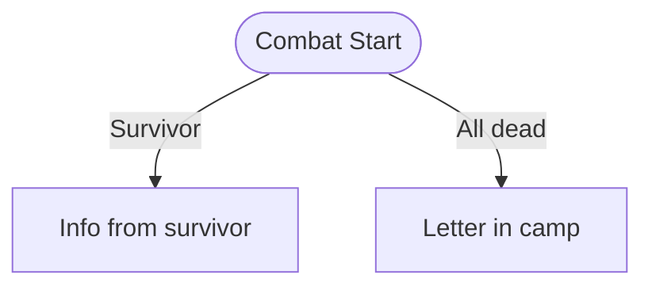

**CombatStart:**
- **If at least 1 bandit survives:** Obtain the Chancellor's location from the survivor(s).
- **If all bandits dead:** Explore the camp for clues. Mission objective: find the Chancellor's location (letter).

---

## Scenario 2: Camp Found, Elias Alone

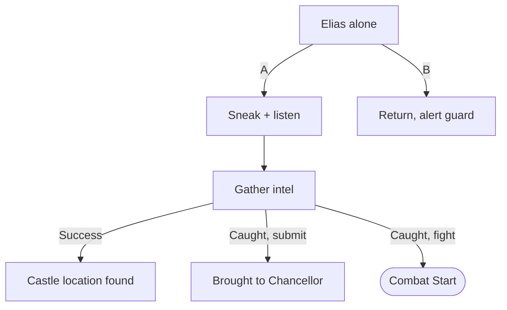

**Scen2.** You were able to find the bandit camp. You are already at the camp, alone. Infiltration will be much easier alone, but a frontal assault will be much harder.
- **Option A:** Sneak around the camp and listen in until you find the bandit leader.
- **Option B:** Return to Cindral to alert the guard.

**S2A_Obj.** Mission objective: obtain information on the bandits and their leader (stealth).
- **Success:** Location of the Chancellor's castle found.
- **Caught, submit:** Submit to be brought to the bandit's leader, then to the Chancellor.
- **Caught, fight:** Fight your way out. Resolves using the [[#Combat Start Resolution|same Combat Start logic]].

---

## Scenario 3: Camp Found, Bandits Alerted

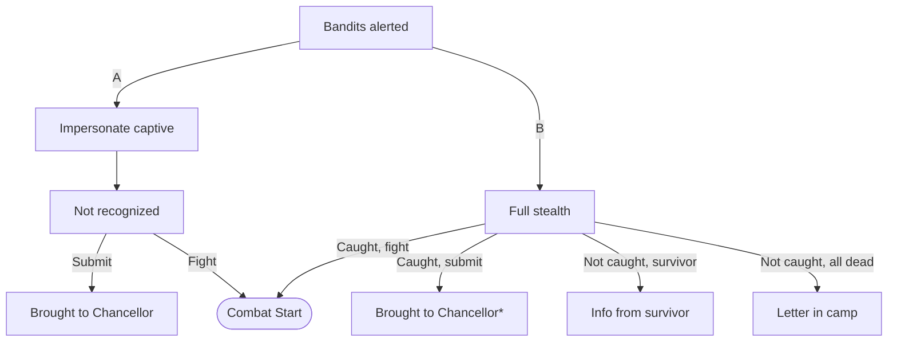

**Scen3.** You were able to find the bandit camp. The bandits are on alert, due to a member of their group being captured. Proceeding will be much more difficult.
- **Option A:** Attempt to impersonate the bandit that you captured by wearing his uniform and infiltrating the camp.
- **Option B:** Full stealth mission — evade detection entirely.

**S3A_Caught.** You are caught by the bandits, as they don't recognize you.
- **Submit:** Submit to be brought to the bandit's leader, then to the Chancellor.
- **Fight:** Fight your way out. Resolves using the [[#Combat Start Resolution|same Combat Start logic]].

**S3B — Full Stealth:**
- **Caught, submit:** Submit to be brought to the bandit's leader, then to the Chancellor. *Not available if any bandits were killed.*
- **Caught, fight:** Fight your way out. Resolves using the [[#Combat Start Resolution|same Combat Start logic]].
- **Not caught, survivor:** At least 1 bandit survives — obtain the Chancellor's location from the survivor(s).
- **Not caught, all dead:** Explore the camp for clues. Mission objective: find the Chancellor's location (letter).

---

## Chancellor's Office

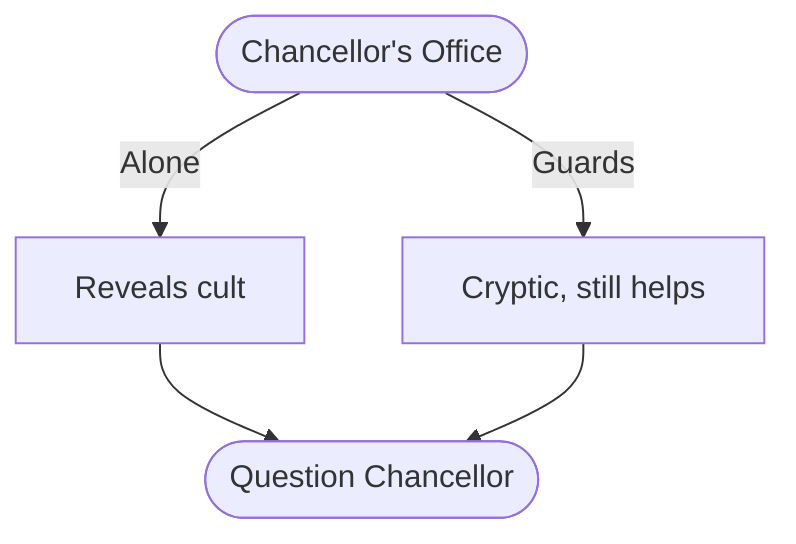

**In the Chancellor's Office.** 

### **Got here by being arrested**
Elias is brought before Chancellor Voss to be interrogated. The Chancellor wishes to know why Elias was sneaking around his men's camp, who sent him there, who he is, etc.

Option 1:
Tell the truth

Chancellor Voss chides Elias for being foolish. Tells him that he is being deceived by Cindral, and that they aren't to be trusted.

Dialogue options:
-Ask Voss why he hired the mercenaries to harass the city.
-Ask Voss to elaborate on why Cindral isn't to be trusted?
-Who are you?

After talking for awhile the Chancellor asks how much Elias is being paid to find out about the bandits. He then offers to pay double for Elias to find out about the cult's yearly ritual, and disrupt the proceedings if at all possible.

Option 2:
Lie (deception)

Elias tells Chancellor Voss:

A: He is a wandering mercenary and heard about the bandit gig. He was looking for work

B: He was passing through, saw the bandit camp, tried to steal from them, and got caught

C: Just a traveler lost in the woods

Option 3:
Refuse to tell him anything

*gets thrown in dungeon*

You now have to escape from prison! congratulations

### *Got here without alerting or fighting the bandits. Obtained information stealthily*

Chancellor Voss is taken by surprise. He is impressed at Elias's skill to not be caught by the bandits, and his success sneaking past his guards into the castle.

Dialogue options:
-Ask Voss why he hired the mercenaries to harass the city.
-Ask Voss to elaborate on why Cindral isn't to be trusted?
-Who are you?

After talking for awhile the Chancellor asks how much Elias is being paid to find out about the bandits. He then offers to pay double for Elias to find out about the cult's yearly ritual, and disrupt the proceedings if at all possible.

### *Elias makes his way back to Cindral*
---
Upon arriving in Cindral, Elias is greeted by Lorean at the front gates. The overworked clerk appears anxious. He asks Elias what happened with the bandits

dialogue options:
- (deception) Tell Lorean that the bandits have been dealt with and won't bother Cindral anymore.
- Placeholder
- Placeholder

Lorean is relieved with this outcome, and says he'll let the mayor know. He then seems confused for a moment, and there is an awkward pause. He then Tells Elias that he will have to inform the mayor's new clerk, as his term of service has ended.

Elias is confused what he means by 'end of service' and asks what he means. Is this an elected position? 

Lorean gloomily tells him that he was chosen for the ascension ritual, so he can't continue his work. He states that if he hadn't been chosen, he was a prime candidate for another term.

Knowing that the cult's rituals are of interest to Voss, Elias is intrigued by the ritual. He asks Lorean for more information on the proceedings.

Lorean tells him that it is a yearly event, and that it is a great honor to be chosen.

He still seems down, so Elias asks him what the issue is if the ritual is considered an honor.

Lorean tells him that he is just sad that he won't be able to continue with his work.

This doesn't add up to Elias, who asks why he can't just continue his work after the ritual.

Lorean says the spirit is freed during the ritual. 

This explanation just makes Elias more confused, to which he cautiously asks what that means. 

Lorean replies that he will no longer be able to associate with worldly matters after the ritual.

Elias makes the realization that Lorean is implying the ritual is a sacrifice. This appalling conclusion springs him to action. He takes Lorean by the shoulders and shakes him a bit and asks if he knows that means he will die.

Lorean replies that his body will meet an end, but it isn't the true end. His spirit will have a better chance to live on.

Elias asks Lorean if he thinks that is right, if he will miss the chance to live the rest of his life. To do the things he finds fulfilling. To finish his work. To make meet new people, and maybe even see new lands *hint hint wink wonk*

Lorean says he's never even left the village, let alone seen anywhere far away

Elias asks him if he would like to, if so he could leave with him now before the ritual.

Lorean refuses, but he hesitates. Elias can tell he is a bit conflicted. Lorean invites Elias to the ritual, saying that he doesn't want them to fight anymore. Elias says he will think about it, restating that he thinks Lorean should leave town before tomorrow. He tells Lorean he will be at the Inn if he changes his mind. They part ways, but Lorean is slightly questioning his preconceived notions about the ritual. Is there more to his life? Should there be more?

*The next day*

Elias wakes at dawn, slightly saddened to see that Lorean didn't take him up on his offer. He gets ready to leave town, packing up all of his things. Then, before he sets out, he realizes that this just isn't sitting well with him. Besides that, Voss will want more information about the cult. There is no better way to learn about the cult than attending the ritual. and, if he just so happens to kidnap a ferret while he's there, so be it.

### *The ritual* 

## Resolution

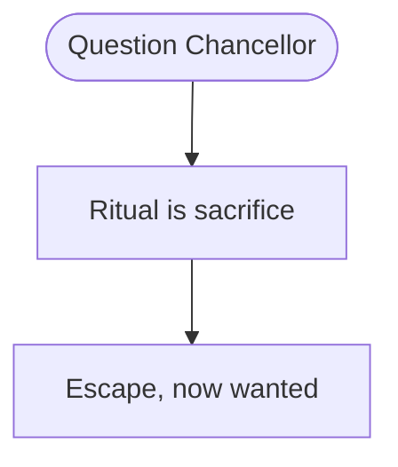

**Reveal.** He realizes that everything the Chancellor said was true when the so-called 'ascension ritual' turns out to be a cultish sacrifice.

**Escape.** Chaos breaks out as he tries to save his newly made friend from this unfortunate fate. They narrowly escape back to the Chancellor's village, now wanted by Cindral's people.
