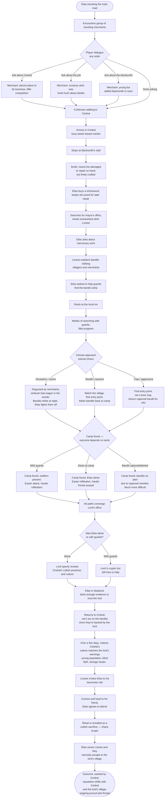

# Elias — Merchants on the Road: Flowchart

```mermaid
flowchart TD
    Start([Elias traveling the main road]) --> Merchants[Encounters group of traveling merchants]

    Merchants --> Q1{Player dialogue<br/>any order}
    Q1 -->|Ask about Cindral| A1[Merchant: decent place to<br/>do business, little competition]
    Q1 -->|Ask about the job| A2[Merchant: scrawny clerk was<br/>hush-hush about details]
    Q1 -->|Ask about the blacksmith| A3[Merchant: young but<br/>skilled blacksmith in town]
    A1 --> Continue
    A2 --> Continue
    A3 --> Continue
    Q1 -->|Done asking| Continue[Continues walking to Cindral]

    Continue --> Market[Arrives in Cindral<br/>busy barter-based market]
    Market --> Blacksmith[Stops at blacksmith's stall]
    Blacksmith --> SwordNote[Smith: sword too damaged<br/>to repair on hand,<br/>but finely crafted]
    SwordNote --> NewSword[Elias buys a shortsword,<br/>keeps old sword for later repair]

    NewSword --> Lorean[Searches for mayor's office,<br/>meets overworked clerk Lorean]
    Lorean --> AskWork[Elias asks about mercenary work]
    AskWork --> BanditIntro[Lorean explains bandits robbing<br/>villagers and merchants]
    BanditIntro --> Task[Elias tasked to help guards<br/>find the bandit camp]

    Task --> Inn[Rests at the local inn]
    Inn --> Weeks[Weeks of searching with guards,<br/>little progress]

    Weeks --> Tactic{Choose approach<br/>tutorial choice}
    Tactic -->|Deception / active| Decep[Disguised as merchants,<br/>ambush bait wagon in the woods.<br/>Bandits strike at night, Elias fights them off]
    Tactic -->|Stealth / passive| Stealth[Watch the village,<br/>find entry point,<br/>follow bandits back to camp]
    Tactic -->|Trap / aggressive| Trap[Find entry point,<br/>set a bear trap,<br/>torture captured bandit for info]

    Decep --> Outcome{Camp found —<br/>outcome depends on tactic}
    Stealth --> Outcome
    Trap --> Outcome

    Outcome -->|With guards| OutA[Camp found, soldiers present.<br/>Easier attack, harder infiltration]
    Outcome -->|Alone at camp| OutB[Camp found, Elias alone.<br/>Easier infiltration, harder frontal assault]
    Outcome -->|Bandit captured/alerted| OutC[Camp found, bandits on alert<br/>due to captured member.<br/>Much more difficult]

    OutA --> LordOffice[All paths converge:<br/>Lord's office]
    OutB --> LordOffice
    OutC --> LordOffice

    LordOffice --> Alone{Was Elias alone<br/>or with guards?}
    Alone -->|Alone| LordOpen[Lord openly reveals<br/>Cindral's cultish practices and culture]
    Alone -->|With guards| LordCryptic[Lord is cryptic but<br/>still tries to help]

    LordOpen --> Skeptic[Elias is skeptical,<br/>lacks enough evidence to trust the lord]
    LordCryptic --> Skeptic

    Skeptic --> ReturnCindral[Returns to Cindral,<br/>can't act on the bandits<br/>since they're backed by the lord]

    ReturnCindral --> Notice[Over a few days, notices Cindral's<br/>culture matches the lord's warnings<br/>-young population, blind faith, strange rituals-]

    Notice --> Invite[Lorean invites Elias to his<br/>'ascension rite']
    Invite --> Curious[Curious and loyal to his friend,<br/>Elias agrees to attend]

    Curious --> Reveal[Ritual is revealed as a<br/>cultish sacrifice — chaos erupts]
    Reveal --> Escape[Elias saves Lorean and they<br/>narrowly escape to the lord's village]

    Escape --> End([Outcome: wanted by Cindral;<br/>reputation shifts with Cindral<br/>and the lord's village;<br/>ongoing pursuit plot thread])
```
